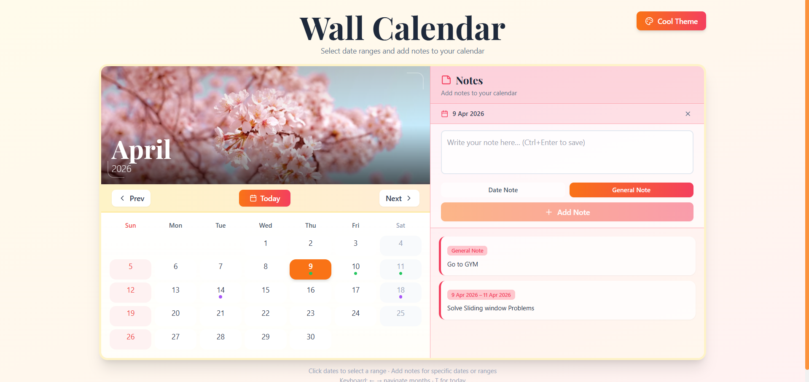
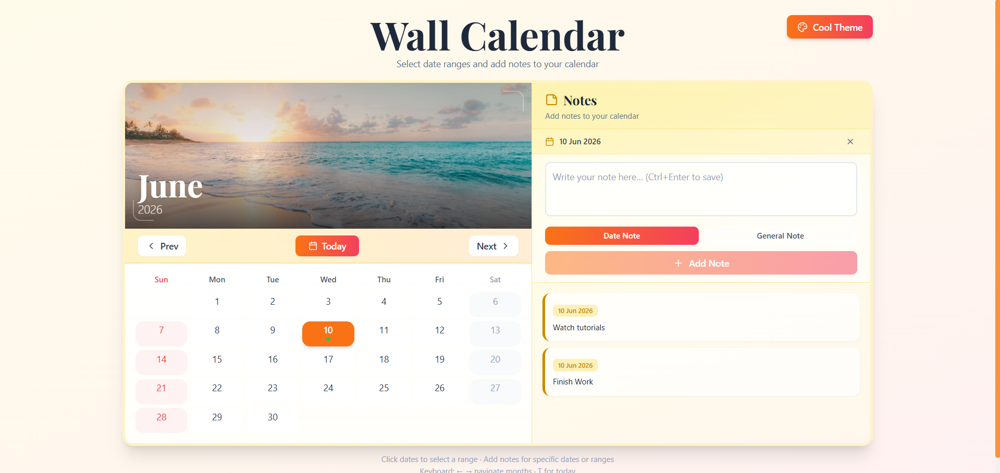

# 📅 Modern Calendar App

A clean, interactive, and responsive calendar application built with **React** and **Tailwind CSS**.
Designed for simplicity, usability, and a smooth user experience.

---

## 🚀 Features

* 📆 **Monthly Calendar View**
* 🔄 **Next / Previous Month Navigation**
* 🗓️ **Weekday Headers (Sun - Sat)**
* 🔴 **Highlighted Weekends (Tinted Red)**
* 📝 **Notes / Events Support**
* 🎯 **Selected Date Highlighting**
* ✨ **Smooth UI with Hover Effects**
* ⚡ **Fast & Lightweight**

---

## 🛠️ Tech Stack

* **Frontend:** React (Vite / CRA)
* **Styling:** Tailwind CSS
* **State Management:** React Hooks
* **Build Tool:** Vite / npm

---

## 📂 Project Structure

```
src/
│
├── components/
│   └── calendar/
│       ├── CalendarGrid.jsx
│       ├── DayCell.jsx
│       ├── MonthNavigation.jsx
│       ├── NotesPanel.jsx
│       ├── ThemeToggle.jsx
│
├── utils/                
│   └── dateUtils.js
│
├── pages/ 
│   └── Calendar.jsx      
│
├── App.jsx
├── main.jsx
├── index.css
tailwind.config.js
package.json
```

---

## ⚙️ Installation & Setup

Clone the repository:

```bash
git clone https://github.com/your-username/calendar-app.git
cd calendar-app
```

Install dependencies:

```bash
npm install
```

Run the development server:

```bash
npm run dev
```

---

## 🎨 Tailwind Setup

Make sure your `tailwind.config.js` includes:

```js
content: [
  "./index.html",
  "./src/**/*.{js,ts,jsx,tsx}",
]
```

And your `index.css`:

```css
@tailwind base;
@tailwind components;
@tailwind utilities;
```

---

## 📸 Preview

## 📸 Preview

<p align="center">
  
  
</p>

---

## 💡 Future Improvements

* 📌 Add event persistence (LocalStorage / Database)
* 🔔 Notifications & reminders
* 🌙 Dark mode support
* 📱 Mobile-first enhancements
* 🔗 Google Calendar integration

---

## 🤝 Contributing

Contributions are welcome!
Feel free to fork this repo and submit a pull request.

---

## 📄 License

This project is open-source and available under the **MIT License**.

---

## 👨‍💻 Author

**Deepak Sharma**

---

## ⭐ Show Your Support

If you like this project, give it a ⭐ on GitHub!

---
